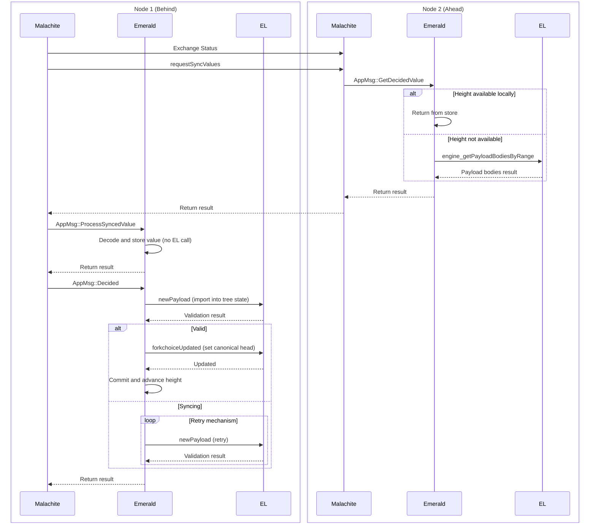

# Syncing

## Overview

### Malachite Sync

[ValueSync](https://github.com/informalsystems/malachite/tree/main/specs/synchronization) is a protocol that runs alongside consensus to help nodes catch up when they fall behind. 
It operates as a client-server system where each node runs both roles simultaneously.

**How it works**:

- **Height announcements** — Servers periodically broadcast their current consensus height to the network.
- **Gap detection** — Clients compare their local height against announced remote heights.
- **Request missing data** — When a client detects it's behind, it requests the missing height(s) from peers.
- **Serve from store** — The server retrieves the decided value and commit certificate from its local store and sends them back.
- **Deliver to consensus** — The client passes the synced data to the consensus layer, which processes it identically to data received through normal consensus operations.

When using Malachite's Channel API, ValueSync interacts with the application through two operations:

- `GetDecidedValue` — Malachite requests a previously decided value from the application's storage (used by the server to fulfill sync requests)
- `ProcessSyncedValue` — Malachite notifies the application that a value has been synced from the network (used by the client to deliver received data)

This design keeps syncing logic separate from consensus while reusing the same validation and commitment paths, i.e, a synced block goes through the same checks as a block decided in real-time.

### Reth Sync

Post-merge, Reth does not autonomously advance its canonical chain. It relies on the consensus layer (CL) to drive block import and chain head selection via the Engine API. Reth's P2P sync is purely reactive and on-demand:

- **`newPayload`** is the primary way blocks enter Reth. It validates and executes the payload, then inserts it into the in-memory block tree (`tree_state.blocks_by_hash`). If the parent is unknown, the block is **buffered** (not rejected) and automatically connected when the parent arrives.
- **`forkchoiceUpdated`** sets the canonical chain head. It requires the target block to already exist in the tree state (imported via `newPayload`). If the block is missing, Reth returns `SYNCING` and emits a `Download` event to fetch it from peers via P2P.
- **`getPayload`** only reads from Reth's in-memory `PayloadStore` (built payloads). It does **not** import blocks into the tree state.

Reth nodes are connected via P2P (explicit peering via `add_peers.sh` or `--trusted-peers`). When Reth detects missing blocks — either through a `forkchoiceUpdated` pointing to an unknown hash or through peer announcements (`NewBlockHashes`, `NewBlock`) — it downloads them from peers. However, it will not advance the canonical chain until the CL instructs it via `forkchoiceUpdated`. The CL is the authority on what's canonical.

In Emerald's architecture, `newPayload` is the optimal path for feeding blocks to Reth during sync: Emerald already has the full payload from Malachite's ValueSync, so importing it directly is faster and more reliable than waiting for Reth P2P download.

### Emerald Sync

## Sync Request Handling

The sync request contains the height. The expected response includes the `value_bytes` and the commit `certificate`.

When Emerald receives `AppMsg::GetDecidedValue`, it processes it as follows:

1. Check if the requested height falls within the available range (`earliest_certificate_height..consensus_height`). If not, return `None`. See [Pruning](#pruning).
2. If the full block data is available locally (height >= earliest unpruned height), return it directly from storage.
3. Otherwise, reconstruct the payload from the locally stored block header and the block body fetched from the EL via `engine_getPayloadBodiesByRange`. If the EL cannot provide the body (pruned or unavailable), return `None`. See [Block Reconstruction](#block-reconstruction).

### Block Reconstruction

`engine_getPayloadBodiesByRange` returns only transactions and withdrawals — not the header fields (parent_hash, state_root, timestamp, etc.). To reconstruct a full payload, Emerald stores block headers (the payload with transactions and withdrawals stripped) at commit time. This keeps storage lightweight while allowing full payloads to be reconstructed on demand from header + EL body.

`eth_getBlockByNumber` could serve a similar purpose, but `getPayloadBodiesByRange` was chosen because it is purpose-built for sync. Currently it is called with a count of 1 (one block at a time). Although `getPayloadBodiesByRange` supports range queries, Emerald cannot take advantage of this because Malachite requests only one value at a time from the application via `GetDecidedValue`. At the consensus level, nodes request batches of values from each other, but consensus delivers them to the app one by one, so Emerald has no way of knowing what the remaining values in the batch are.

### Pruning

Emerald prunes two categories of data independently:

- **Certificates + block headers**: retained for the last `num_certificates_to_retain` heights (default: unlimited). Pruned every `prune_at_block_interval` heights (default: 10). This defines the `earliest_certificate_height` — the lower bound for sync requests.
- **Block data** (decided values, undecided proposals, pending parts): retained for the last `num_temp_blocks_retained` heights (default: 10). This defines the `earliest_unpruned_height` — below this, block bodies must be fetched from the EL.

For heights where block data has been pruned but certificates remain, Emerald reconstructs the payload from the stored header + EL body (see [Block Reconstruction](#block-reconstruction)). If the EL has also pruned the block (depends on Reth's node type and pruning config), the sync request returns `None`.

> [!WARNING]
> In order for a node to be able to sync from any height, there has to be at least one archival node in the network that can provide historical data. We plan to add snapshot syncing to remove this constraint.

## Sync Response Handling

Upon receiving a response from a peer, Malachite provides the `height`, `round`, `proposer`, and `value_bytes` to the application (Emerald) via the `AppMsg::ProcessSyncedValue` message.
The application processes it as follows:

1. Decode the value from its wire format.
2. Store the block data as undecided so that it can be retrieved when the `Decided` message arrives.
3. Return the decoded value to Malachite without calling the EL.

No `newPayload` call is made during this step. Malachite has already verified the commit certificate, proving that 2/3+ of the validator set accepted this value, so EL validation is redundant.

The proposal is thus marked as `valid`. 

The `newPayload` call is deferred to the `Decided` handler, where it is required to import the block into Reth's tree state before `forkchoiceUpdated` can set it as canonical head. If Reth returns `SYNCING` (e.g., because the parent block is not yet available), the retry mechanism re-sends the request until Reth returns `VALID` or  `INVALID`. Note that in order to get to this point, the CL will have to have obtained 2/3+ certificates validating this block, thus the EL should never return `INVALID` at this point. In case it does, the node will not be able to proceed. 

## Sync Configuration

### Emerald Configuration (`emerald.toml`)

| Parameter | Default | Impact on syncing |
|-----------|---------|-------------------|
| `num_certificates_to_retain` | unlimited (`u64::MAX`) | Determines how far back this node can serve sync requests. Once a certificate is pruned, the corresponding height can no longer be served to peers.  This value should follow the pruning related configuration of the EL. |
| `num_temp_blocks_retained` | 10 | Number of heights for which full block data is kept locally. Below this, block bodies must be reconstructed from stored headers + EL. |
| `prune_at_block_interval` | 10 | How often (in heights) certificate pruning runs. Does not affect block data pruning, which runs every height. |
| `retry_config.max_elapsed_time` | 10s | Total timeout for `newPayload` retries when Reth returns `SYNCING` during the `Decided` handler. If exceeded, the node errors. |
| `retry_config.initial_delay` | 100ms | Initial delay between retry attempts (exponential backoff with 2x multiplier, capped at `max_delay`). |
| `el_node_type` | `archive` | Declares the Reth pruning mode. Affects whether `getPayloadBodiesByRange` can serve old blocks when reconstructing pruned data. |

> [!IMPORTANT]
> `num_temp_blocks_retained` must be >= Reth's `engine.persistence-threshold`. If it is lower, the node will not be able to restart after a crash because Emerald will have pruned block data that Reth has not yet persisted to disk.

### Reth Configuration

| Parameter | Impact on syncing |
|-----------|-------------------|
| `--trusted-peers` / `add_peers.sh` | P2P connectivity between Reth nodes. Required for Reth to download blocks from peers when `forkchoiceUpdated` points to an unknown block. |
| Node type (archive / full / custom) | Archive nodes retain all blocks from genesis. Full nodes prune old blocks, which means `getPayloadBodiesByRange` may return `null` for pruned heights. Must match Emerald's `el_node_type` setting. |
| `engine.persistence-threshold` | How many blocks Reth keeps in memory before flushing to disk. Must be <= Emerald's `num_temp_blocks_retained` (see above). |

## Example Flow

Consider a node that falls behind. Both Malachite and Reth detect they are lagging (Malachite via status exchanges, Reth via P2P peer announcements).

Malachite drives the catch-up. For each missing height, a peer's Malachite asks its local Emerald for the decided value (`GetDecidedValue`). Depending on what's available locally, Emerald either returns the value from storage or reconstructs it from the stored header + EL body (see [Sync Request Handling](#sync-request-handling)).

On the catching-up node, Malachite delivers each synced value to Emerald (`ProcessSyncedValue`), which decodes and stores it. When Malachite confirms the decision (`Decided`), Emerald imports the block into Reth via `newPayload` and advances the canonical head via `forkchoiceUpdated` (see [Sync Response Handling](#sync-response-handling)).

If Reth returns `SYNCING` (e.g., because it hasn't yet received the parent block from its own P2P sync), Emerald retries until the import succeeds or times out.
